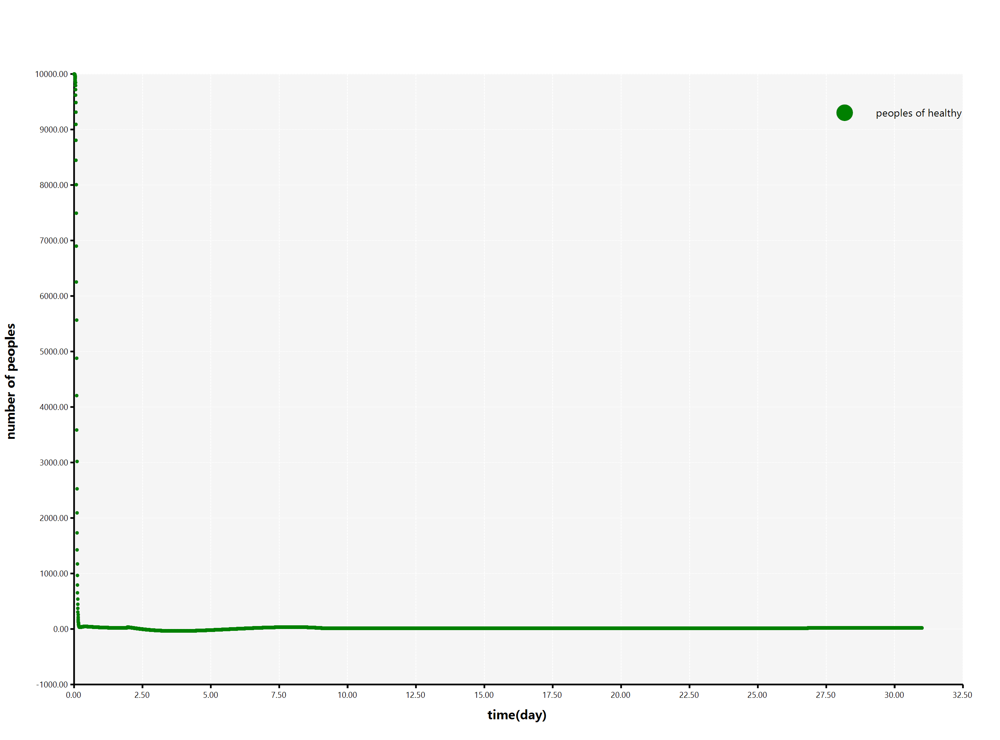

# Kinetics model of SARS-CoV-2 virus infection in humans

An infectious disease kinetics model of SARS-CoV-2 virus infection in humans with population migrating details for predicts the plague progress in a administrative divislon.

### Demo

