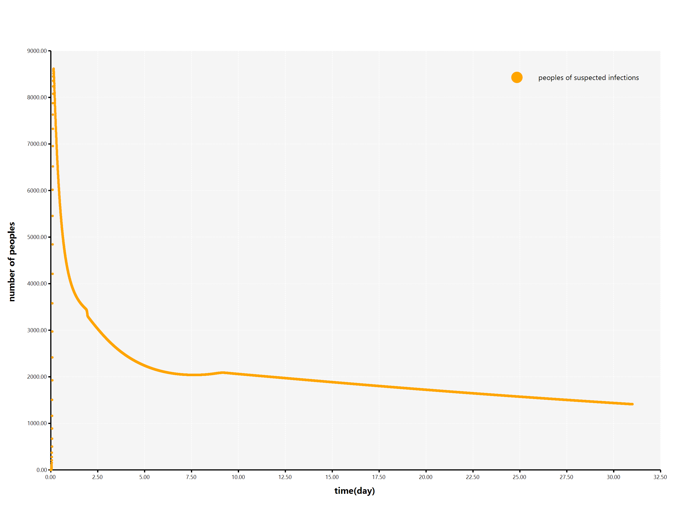

# Kinetics model of SARS-CoV-2 virus infection in humans

###### [WARNING] This project is a work in progress and is not recommended for production use.

An infectious disease kinetics model of SARS-CoV-2 virus infection in humans with population migrating details for predicts the plague progress in a administrative divislon.

### Demo

### Visualize on the map of China

#### How to use

 