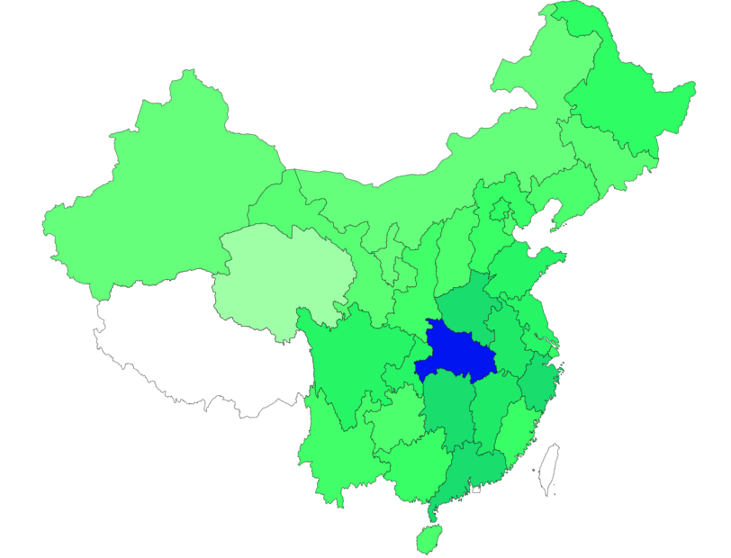
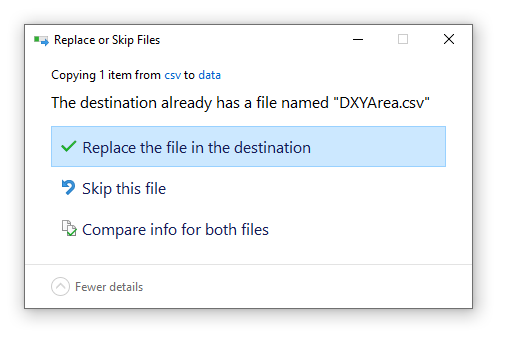
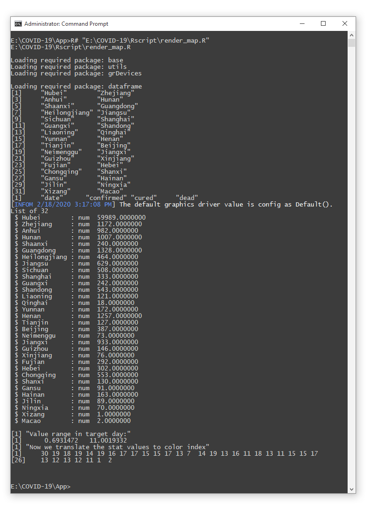

# Map Visualization of the Plague COVID-19 in China

# How to use



## First, get raw data

Download raw data file from location: https://github.com/BlankerL/DXY-COVID-19-Data/blob/master/csv/DXYArea.csv

## Second, update raw data

Overrides the old data at location [DXYArea.csv](../data/DXYArea.csv), example as:



The you can run the script ``data.R`` and ``delta_data.R`` for update to the latest data. The result data table is saved at location [/data](../data), named ``DXYArea_simple.csv`` and ``COVID-19_delta.csv``

```cmd
REM run in windows commandline
R# "/path/to/Rscript/data.R"
R# "/path/to/Rscript/delta_data.R"
```

+ [../data/DXYArea_simple.csv](../data/DXYArea_simple.csv) is the accumulative data of ``COVID-19`` in china.
+ [../data/COVID-19_delta.csv](../data/COVID-19_delta.csv) is the incremental data of ``COVID-19`` in china.

## Finally, do map render

Modify the script content in file ``render_map.R`` by following the instruction in the script file, and then run script, then you will get the rendered China map of ``COVID-19`` as you wish.

```cmd
REM run in windows commandline
R# "/path/to/Rscript/render_map.R"
```



enjoy!